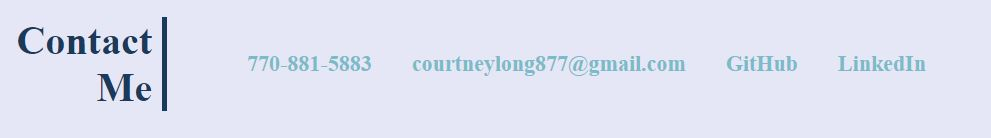

# My-Portfolio
Portfolio of my accomplishments and strengths.  This is a representation of who I am and what I have to offer.

## Header

The header has links to take the user to different sections within the website, and a download link for my resume.

## About Me

I have a background of who I am, my accomplishments to this date, and my interests.
* The background is split into two paragraphs, one to show my professional accomplishments, and the second to show my personality and interests.

## Work

I have projects that are not real in my Work section that will be replaced with actual ones as I create them.

## Contact Me

My contact information is at the bottom with links to my GitHub and LinkedIn. 

* The hyperlink formatting was removed to show consistent font theming throughout.

## Footer
A footer contains a little message to the user.